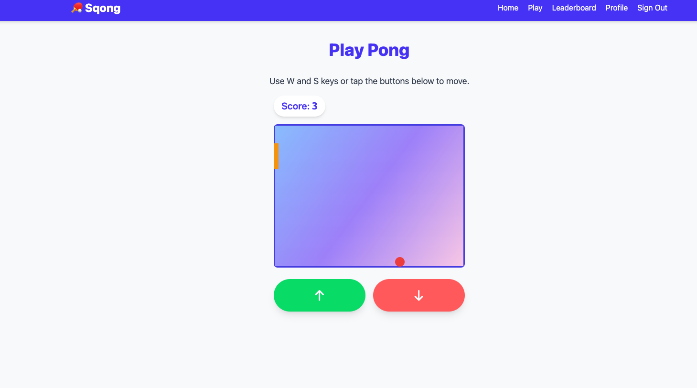
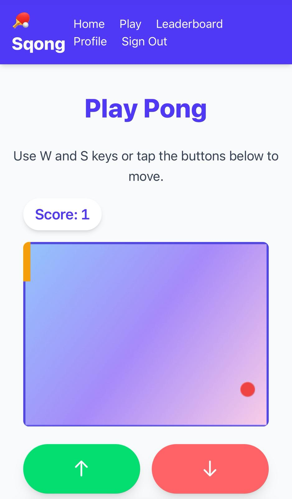

# README
# Sqong
My first project; a single-player Pong-style game built with Ruby on Rails and Stimulus.

LINK: https://sqong-pong-6fb7391c8389.herokuapp.com/

## Features
-> User Sign in/ Sign up (Devise)
-> Score tracking
-> Mobile responsive

## Screenshots

